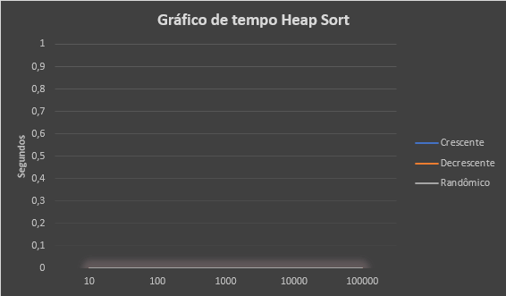
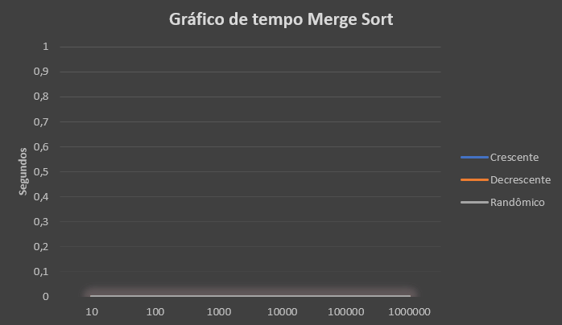
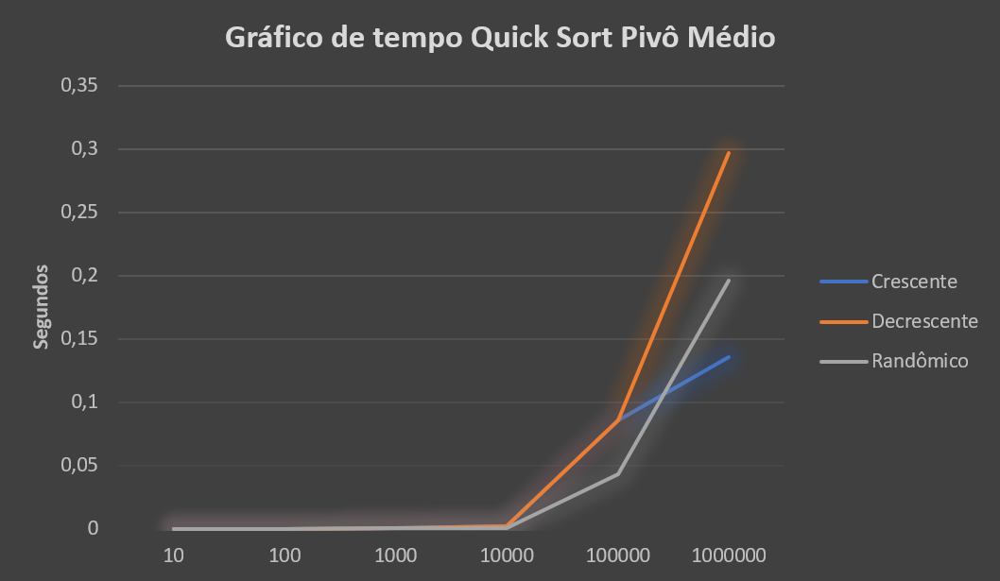
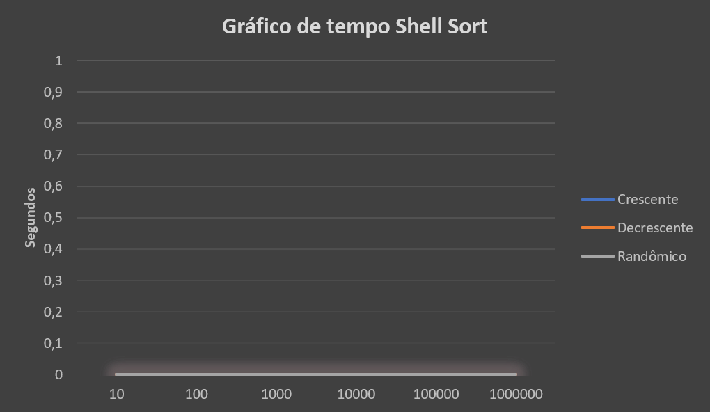

# SortLab

SortLab e um laboratorio em C para gerar entradas, executar algoritmos de ordenacao e registrar arquivos de saida e tempo de execucao.

Este repositorio foi organizado para fins avaliativos e para projetos desenvolvidos durante a disciplina de **Projeto de Algoritmos** da **Universidade Federal de Vicosa (UFV)**.




## Algoritmos implementados

- Insertion Sort
- Bubble Sort
- Shell Sort
- Selection Sort
- Merge Sort
- QuickSort com pivo inicial
- QuickSort com pivo medio
- QuickSort com pivo aleatorio
- Heap Sort

## Como compilar

Com GCC/MinGW no Windows:

```powershell
.\build.ps1
```

Com Make em Linux, macOS, WSL ou Git Bash:

```bash
make
```

O executavel sera gerado em `build/sortlab` ou `build/sortlab.exe`.

## Como executar

No Windows:

```powershell
.\build\sortlab.exe
```

No Linux, macOS, WSL ou Git Bash:

```bash
./build/sortlab
```

Depois escolha:

- o algoritmo no menu principal;
- o tipo de entrada: `c` crescente, `d` decrescente ou `r` randomica;
- o tamanho: `10`, `100`, `1000`, `10000`, `100000` ou `1000000`.

## Arquivos gerados

Cada execucao cria uma estrutura como:

```text
HeapSort/
  arquivodeentrada/randomico/entradar1000.txt
  arquivodesaida/randomico/saidar1000.txt
  arquivotempo/randomico/tempor1000.txt
```

Essas pastas sao ignoradas pelo Git porque sao resultados de experimento. Exemplos fixos ficam em [`data/exemplos`](data/exemplos).

## Documentacao

- [`docs/estrutura.md`](docs/estrutura.md): organizacao do repositorio.
- [`docs/experimentos.md`](docs/experimentos.md): roteiro para executar e comparar os algoritmos.
- [`data/README.md`](data/README.md): formato das massas de teste.

## Galeria






