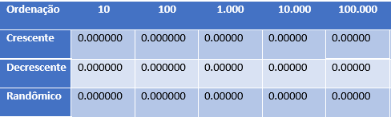
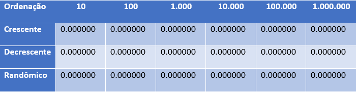
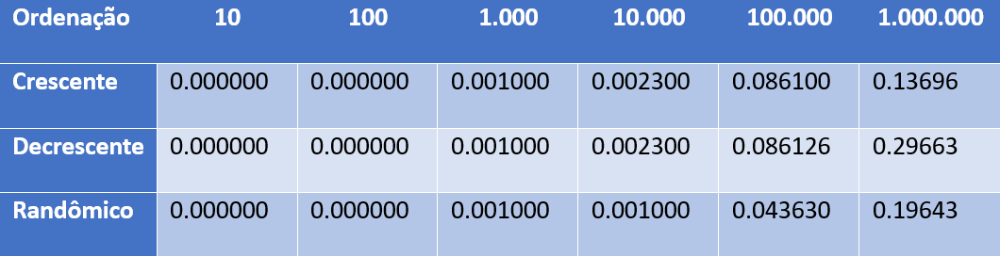

# Roteiro de experimentos

## Objetivo

Comparar algoritmos de ordenacao em entradas crescentes, decrescentes e randomicas, observando o tempo de execucao e a corretude da saida.

## Entradas

Tipos aceitos:

- `c`: vetor ja em ordem crescente;
- `d`: vetor em ordem decrescente;
- `r`: vetor randomico.

Tamanhos aceitos:

- `10`
- `100`
- `1000`
- `10000`
- `100000`
- `1000000`

## Execucao sugerida

1. Compile o projeto.
2. Execute o programa.
3. Escolha um algoritmo.
4. Escolha o mesmo tipo e tamanho para cada algoritmo comparado.
5. Consulte os arquivos em `arquivotempo` para comparar os resultados.
6. Consulte os arquivos em `arquivodesaida` para verificar se a saida esta ordenada.

## Observacoes de analise

Algoritmos quadraticos, como Bubble Sort, Insertion Sort e Selection Sort, tendem a ficar muito lentos em entradas grandes. Merge Sort, QuickSort, Shell Sort e Heap Sort sao mais adequados para comparacoes com `100000` ou `1000000` elementos.

O QuickSort pode variar bastante conforme a escolha do pivo e o tipo da entrada. Por isso o projeto mantem tres variantes: pivo inicial, pivo medio e pivo aleatorio.

## Imagens de apoio

